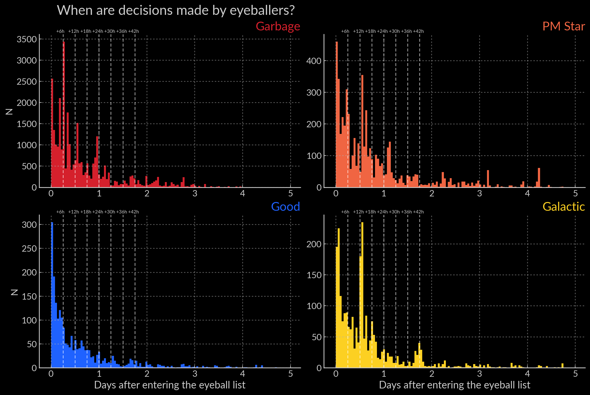
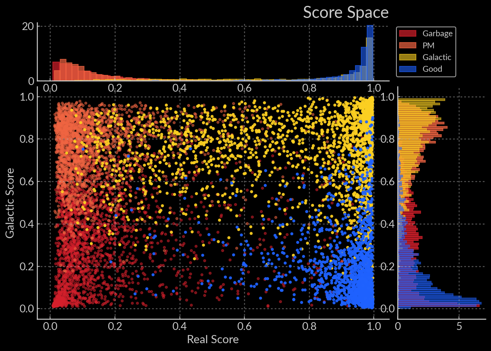
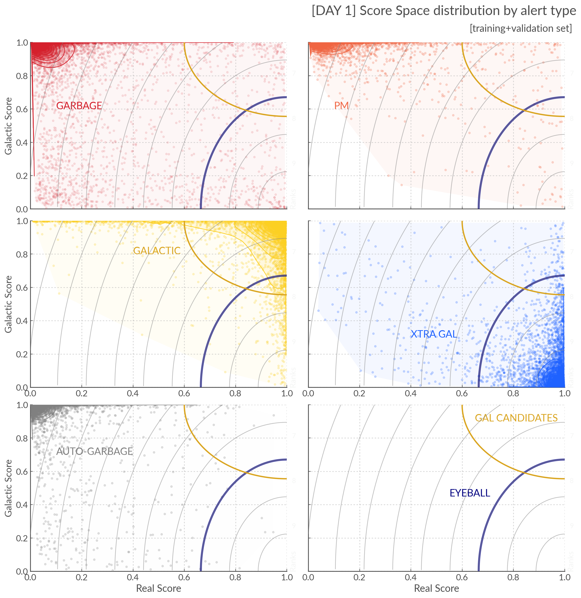
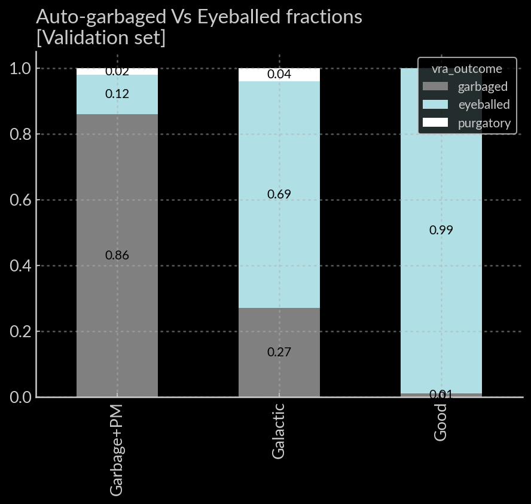

The Virtual Research Assistant
=================================
.. _Tonry et al. 2018: https://ui.adsabs.harvard.edu/abs/2018PASP..130f4505T/abstract
.. _Smith et al. 2020: https://ui.adsabs.harvard.edu/abs/2020PASP..132h5002S/abstract
.. _Sherlock: https://lasair.readthedocs.io/en/develop/core_functions/sherlock.html
.. _Weston et al. 2024: https://ui.adsabs.harvard.edu/abs/2024RASTI...3..385W/abstract
.. _scikit-learn docs: https://scikit-learn.org/stable/modules/ensemble.html#histogram-based-gradient-boosting

*This page is a high level overview the ATLAS VRA: why it exists and what it does*
*For more details on the data used to train it and the types of models used you can the Data and Models pages*

Data Journey: From Telescope to Transient Name Server
------------------------------------------------------------

.. seealso::
   Survey Design: `Tonry et al. 2018`_ | Transient Server `Smith et al. 2020`_

The ATLAS data are first reduced (debiased and flat fielded) on site before
being sent to Hawaii for difference imaging. Alerts are produced if a detection
above 5 sigma is recorded, and these form the data stream that is handled by
the servers at Queen's University Belfast.

The alert stream size is of order 10s millions per night. Most of these are artefacts from the
difference imaging process, or known variable stars. The stream processing steps are:

1. **Alerts to Sources**: We aggregate individual alerts into sources (one source will likely have mutiple alerts). If the source is new, its unique 19 digit ATLAS ID is created.
2. **Basic Cuts**: Some simple quality cuts can help reduce the volume of the data stream. The main requirement is that **at least 3 detections per source (per night)** are required to move onto the next stage.
3. `Sherlock`_ catalogue cross matching and **remove variable stars**.
4. **Real/Bogus Score**: We use a Convolutional Neural Network to classify the alerts as real or bogus (see `Weston et al. 2024`_ ). **If the RB score >0.2** they are passed on to eyeball list
5. **Eyeball list**: The alerts are eyeballed and classified as ``garbage``, ``pm`` (proper motion star), ``good``  or ``attic`` (for real alerts from transients within the galaxy). Good alerts are automatically pushed to TNS.

The eyeball list in ATLAS still receives between **1000 and 3000 alerts**
every week depending on weather and phase of the moon.
Despite the fact that the CNN removes 98.5% of alerts, most of the eyeball list is still garbage.

.. figure:: _static/pie_chart.png
   :width: 500
   :align: center

    Pie chart showing the distribution of alerts in the eyeball list from data gathered between 27th March and 13th August 2024.

The Challenge of Automation
----------------------------------------
The difficulty in automating the eyeballing process further is two fold:

1. We need **very high completeness** (we don't want to miss cool transients)
2. Humans are FAST at the eyeballing task. Meaning they need *little* data

.. important::
   Given the cadence of ATLAS, people making over 90% of decisions within 24/48 hours means they most often only have **one to two lightcurve points** to look at.

    Histograms split by types showing the delay in human decisions

Because lightcurve information is spares, classic transient classifiers made to reproduce
spectroscopic classifications using only the lightcurve information are
**never going to have sufficient information** to be useful in this regime.
We therefore need to bridge the gap between the Real/Bogus classifiers (day 1 regime)
and the Transient classifiers (day 7+ regime).

The VRA is designed to emulate the decision making of the eyeballers,
and to leverage as much of the data available on the web server as possible.
In addition to using the RB score, the virtual eyeballer ``st3ph3n`` also uses
**context** and **lightcurve features**  and it follows  a similar strategy
to the human team by asking **two questions**:

- *Does this alert look REAL?*
- *Does this alert look GALACTIC ?*

Real and Galactic Scores
-----------------------------------
To calculate the Real and Galactic scores, we train models called
Histogram base Gradient Boosted Decision Trees (see `scikit-learn docs`_ ).
Both models use **the same features** but they **calculate scores independently**,
and they are trained separately.

They each score the alerts **from 0 to 1**, such that we can place our alerts in a plot
we call the score space:

    Score space showing the balanced training data for the Crabby models

Because we care about **extragalactic transients** we are interested in alerts
nearest the **bottom right** (real=1, galactic=0).
We're going to use this to calculate the ranks.

Finally, the alerts are **scored again every time new  data is available**.
There is a distinction between the models that score when first entering the eyeball list (``day1`` models)
and those updating the ranks on future visits (``dayN`` models), in that the latter
use additional features (see the Data section). But the ranking logic remains the same.

Ranking
-----------------------------------
To rank our alerts we now use the *pythagoras theorem*.
The bottom right hand corner of the plot is the "most" Real and Extra-galactic.
Hypothetically that is the alert we care about the most.
To calculate the ranks we therefore **calculate the distance to that (1,0) point**.
Now... there are a couple extra steps.

- I scale the galactic axis by 0.4 to separate the garbage from the real alerts more effectively.
   It also ensures our eyeballing policy (see below) encompasses the real=1, galactic=1 corner.
- To get a score between 0 and 10 you also have to invert the distance (the smaller the distance the higher the score),
   normalise by the diagonal of the plot and multiply by 10.

.. important::
   **TL;DR**: The closer to the Real-ExtraGalactic corner (1,0) - the higher the rank.
   A **rank = 10** is a special case were a TNS crossmatch has been found.

.. warning::
   In the previous version of the VRA the scaling factor was 0.5. This means the new models will give you a few more alerts to eyeball with more contamination down in the rank 4-6. But we're also less likely to miss real galactic alerts.

Policies
---------------------------------------
The goal of the VRA is to reduce human workload so now that we have the ranks we need to decide

1. Which alerts are worth asking the humans to eyeball
2. Which ones we can ditch automatically

.. note::
   **Nothing is deleted** from the server when an alert is garbaged. It's just *tagged* as garbage.

Eyeballing
~~~~~~~~~~~

The current eyeballing policy is to ask human experts to check everything
with a ``rank >4``. As we can see in the figure below, this encompasses
nearly all the extra-galactic alerts (blue) and a large fraction of the galactic alerts (yellow).

    Here we show the score space distributions for each alert type. We also plot the VRA rank contours.

.. warning::
   Due the the distribution of the galactic alerts extending quite far down the Real axis, this policy means that a non negligible fraction of galactic transients will be missed. See the discussion at the bottom of this page for more info.

Garbaging
~~~~~~~~~~~~~
.. _garbaging:

There are currently three "garbage collection" policies in place:
* On **entering the eyeball list** with ``rank<1.0``
* On a **second visit**, ``max(rank)<2.0``.
* On the **third and subsequent visits**, ``mean(rank)<3``.

Because the cadence is often 2 to 3 days, after the 3rd or 4th visit we will
get close to +15 days after initial alert, which falls out of the training window.
Because we eyeball everything with rank >7.5 these garbaging policies will leave some alerts in
what is called the "purgatory".
These are now being handled by ``el01z``  (see the Monitoring section) which has a sentinel looking out for
alerts that are left in purgatory after they have fallen out of ``st3ph3n`` 's training window.
There are few of those and they are sent to the slack for eyeballing.

Discussion
~~~~~~~~~~~~~
Testing the effect of the policies on static data is tricky as we do not have
an eyeball list refilling every day.
What we can do thought is assess the effect of the eyeballing and garbaging policies on our
validation set to see what fraction of our ``good``, ``galactic`` and ``garbage`` + ``pm``
alerts will get eyeballed and auto-garbaged.
The plot below shows this for the current generation of models.

    Fraction of alerts eyeballed Vs auto-garbaged for the different alert types given our current policies.

As we can see we eliminate 86% of the garbage and recover all the good ones save fore one event.
However we do end up "sacrificing" 27% of the galactic alerts.

At present this is an acceptable loss since our science case is focused on extra galactic transients.
This could be remedied in the futures either by:

1. Having a separate policy and eyeball list focused on galactic alerts. This would require a dedicated team of galactic eyeballers (likely people connected to those science  cases)
2. Changing the ranking policy to a more complex function which better captures the shape of galactic event distribution.

The former option is not viable right now since we do not have enough team
members to add this extra layer of operations.
The second option is disfavoured because the simplicity of the ranking function
makes it very understandable for the people who use it in our current team.

.. caution::
   The fact that we are auto-garbaging galactic alerts means the garbage list will now have more contamination of real low SNR galactic events. We will have to be careful when creating future training sets to not introduce confusion to future models.

.. note::
   We have not cleaned the training set by giving it another round of eyeballing. Of the 30% of "lost" galactic objects, a signification fraction may actually be garbage.

