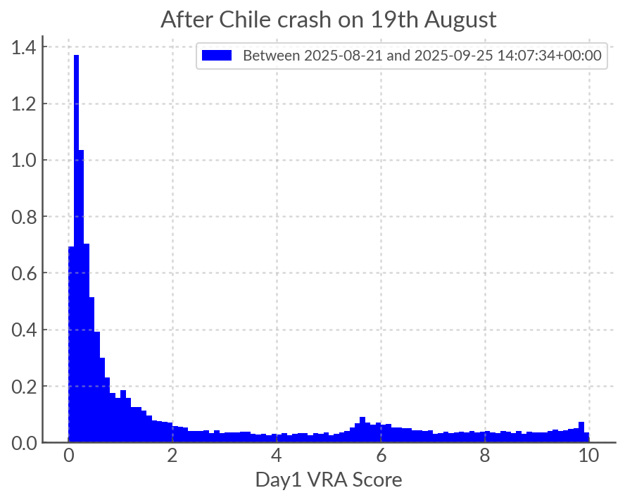

ATLAS TDO Notes
==========================

The new unit of ATLAS (in Teide) started being ingested on 2025-06-23 (MJD 60,849).
Currently things are running without bespoke wallpapers, CNNs or VRA retraining. 
In these notes I roughly assess the effect of the addition of TDO to our data-stream and 
the VRA retraining strategy in the short term. 

How TDO impacts the eyeball list
----------------------------------
Overall, the number of weekly alerts has increased by a factor of at least 2 since TDO came online. 
The spikes in the figure below are due to some catastrophic failures (trailing or other acute incidents), and the other
smoother variations are due to the lunar cycle. 

.. figure:: _static/n_alerts2025.png
   :width: 500
   :align: center

Overall, TDO contributes as many elerts to the eyeball list (after quality cuts, sherlock and CNNs) as the 4 other units. 

**Either TDO contributes more alerts overall, or its garbage alerts are not being filtered as effectively by quality cuts and the CNN**. 

How TDO impacts the VRA
-------------------------
Over the past few months the purgatory has been larger than usual so we know that TDO is affecting the VRA; here we look a little closer at what is happening.

Below we have the distribution of alert labels before TDO (**2025-05-01 to 2025-06-22**) and after TDO (**2025-06-23 to 2025-09-25**).
As we can see the main effect is to increase the fraction of **Garbage** alerts, meaning that there is more 
contmination in the extra-galactic and galactic eyeball lists by bogus alerts. 

Either the VRA is worse at classifying alerts since TDO, or the increase in garbage alerts is sufficient to increase contamination.
We can test this by looking at the VRA score distribution before and After TDO. 

.. warning::
   There was a catastrophic failure on 19th August leading to around 40,000 bogus alerts entering the eyeball 
   list and receiving high VRA scores. These dates are excluded entierly from the data set and analysis below.
   They do not affect the pie charts above as they were not removed manually from the eyeball list and therefore
   did not get a human label of "garbage".

As we can see below, the **VRA score distribution IS affected**. 
The primary effect is to **displace very low scores towards middling scores** and the 
**peak at high scores is diminished**.
The peak around VRA score 5 remains but it is there mostly by construction  (Galactic list).

.. figure:: _static/scores_beforeTDO.png
   :width: 450
   :align: center

.. conclusion::
   I suspect that the "flattening" of the distribution is due to data drift. 
   TDO does add more garbage alerts to the eyeball list overall (otherwise it would not DOUBLE its size)
   and sice the VRA was not trained on TDO data it would not perform as well, but in addition 
   we may expect the **distribution of some of the lightcurve features** to be different for the 
   alerts in the Northern Hemisphere, since we count for example the number of detections and non detections. 

Strategy to handle TDO
-------------------------
* **Create bespoke wallpapers to reduce bogus alert production**: The bottleneck is the vetting of the images to put in the wallpaper stacks.
  and the people who would do this are essentially members of the Oxford and Belfast group who are currently otherwise occupied (LSST, SoXS).
  **For human resource reasons this is not feasible in the short term**.
