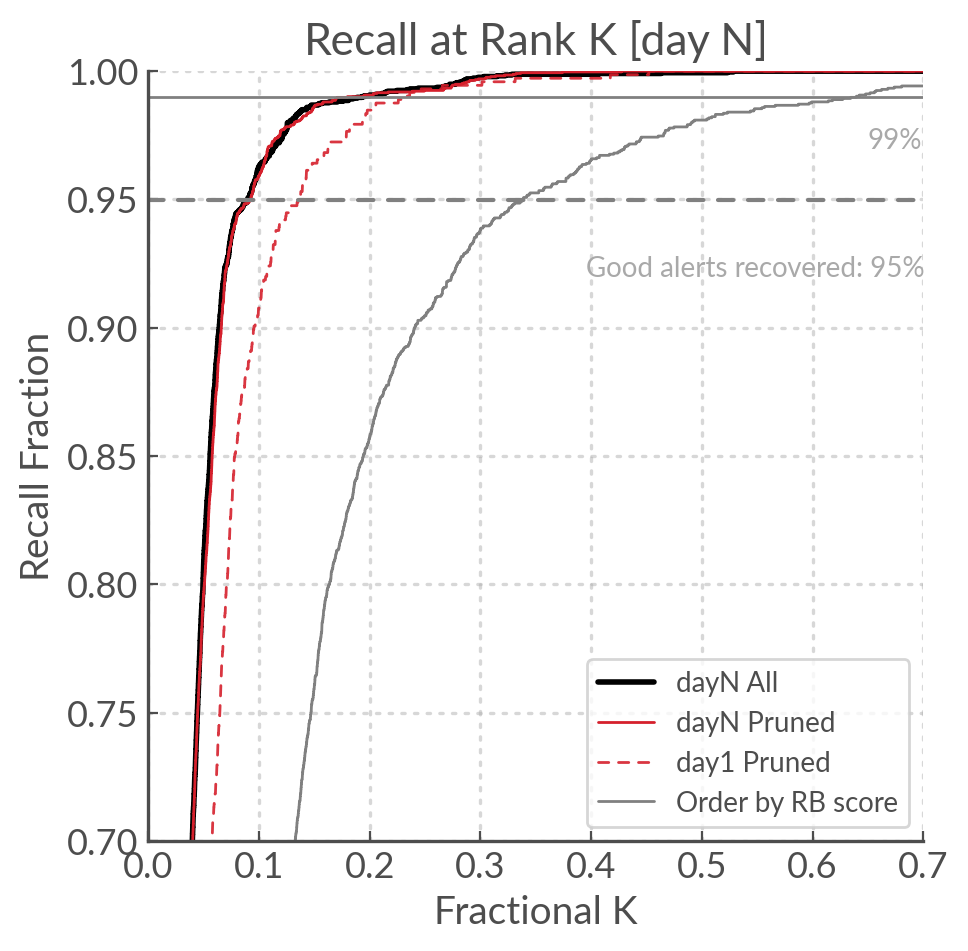

Models and Metrics
==================

Histogram based Gradient Boosted Decisions Trees
--------------------------------------------------------
The place our alerts in score space we want to create two classifiers:
a real/bogus and a galactic/extragalactic  (four if we include the ``day 1`` and ``day N`` variants).
We chose to use Histogram Based Gradient Boosted Decision Trees (HBGDT) because they have been shown to perform well on tabular data \textbf{[refs]} which is what our data set mostly consists of.

Light curve data in its raw state is a time-series, which is not handled well by such feature-based classifiers.
This is why we devised an array of features to capture long and short term light-curve behaviour.
Although there exists other forms of machine learning such as neural networks (especially recurrent neural networks) that could use the raw light-curve as input, there are two reasons why we did not chose to use such models.
Firstly, neural networks are data-hungry. To be trained effectively they require data sets of order 50 times the number of parameters in the model.
This would require us to have hundreds of thousands to millions of samples, so we would have to simulate data or over sample what we do have.
HGBDT however can perform well with only a few thousand examples.

The second reason is that light-curve information is not rich on the timescales considered here, and it is difficult to represent astrophysical time series in classic ML and statistic tools.
For example these do not natively handle non-detection information (a non-detection is *not* the same as no observation) and that typically requires adding an additional feature (e.g. boolean flag).
On the whole we prefer engineering features based on our understanding of the light-curve information and our goals.

We use the scikit-learn implementation of the HGBDT, which is based on LightGBM.
There are several advantages to the histogram based approach, of main importance to us is the native handling of null values.
In most machine learning models null values need to be imputed, in the HGBDT the feature values are discretised into histograms with (typically) 256 bins, 255 of which are used for numerical values and the final bin for null values \footnote{see manual page for HGBDT in {\tt scikit-learn} \url{https://scikit-learn.org/stable/modules/generated/sklearn.ensemble.HistGradientBoostingClassifier.html}}.
Another advantage (and the main reason this improvement on the original algorithm was devised) is their speed.
This is mostly a concern when dealing with tens of thousands of training samples.
For a more in-depth introduction to gradient boosted classifiers, see **[Appendix in the paper]**.

Area Under the Recall at rank K
-----------------------------------

The Recall at rank K (R@K) is defined as the ratio of the  [N relevant alerts in top K] over [N relevant alerts].
We can plot it to get a curve, and inspired by the AUC I calculated the area under the recall at rank K (AuRaK)
to use as a metric for the performance of the classifier.

In the Figure below we can see the R@K calculated for our day 1 and day N models, compared to the R@K obtained
by ordering by ``rb_pix`` (the benchmark). In our benchmark the AuRaK is 0.88; for our day 1 and day N models
it rises to 0.951 and 0.966 respectively.

